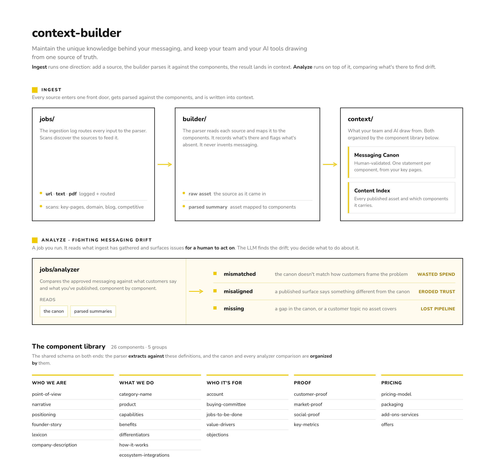

# context-builder

Maintain the unique knowledge behind your messaging, and keep your team and your AI tools drawing from one source of truth.

## Why it exists

Your marketing team can only move as fast as your messaging. And great messaging is built on something only you have: the exact words customers use for the problem, why they really buy, the objection behind the objection, who they compare you to. SEO keyword lists, analyst reports, and generic personas are available to everyone, and to every LLM. Your unique knowledge of the customer and the market is the last advantage you have left.

The tools for managing that knowledge were built for a slower world. The messaging doc goes stale the moment product ships or a competitor moves. Turn it into a skill and someone has to update it by hand and pass it around. Even storing context in GitHub, today's gold standard, still depends on a human remembering to add the new context. These tools are reactive by design: not current, not shared, not proactive.

## The problem it solves: messaging drift

When teams move fast without a living source of truth, messaging drifts. Drift shows up three ways, and the [analyzer](jobs/analyzer.md) names each one:

- **Mismatched.** Your messaging describes the problem in your internal language instead of the customer's, so buyers miss that you can solve it. The cost is wasted spend.
- **Misaligned.** Your site, your outreach, and your decks each say something different, so buyers stop trusting you'll deliver. Ask an LLM what you do and it answers differently every time. The cost is eroded trust.
- **Missing.** A value prop resonates on the homepage but no campaign or asset is built around it, and a new seller who hits an objection can't find a single asset that addresses it. The cost is lost pipeline.

## What it does

The context builder maintains your unique knowledge, proactively flags issues for human intervention, and fights messaging drift. Three capabilities:

1. **Keeps a human-validated canon.** One approved statement per messaging component, compiled from your key pages. The [canon](context/messaging-canon.md) is the core the whole system protects, and what your team and your AI tools read from.
2. **Ingests your knowledge as it accumulates.** Sales calls, win/loss notes, customer interviews, and everything you publish enter through one front door, get parsed against the components, and land as durable summaries. Customer language is captured the moment it shows up, not months later in a doc rewrite.
3. **Surfaces drift proactively.** The analyzer compares the canon against what customers actually say and what your company has published, then writes structured [issues](builder/issues/) tagged mismatched, misaligned, or missing for a human to act on. The LLM finds the drift; you decide what to do about it.

With the canon stable and current, you build shared skills on top of it, so every brief, page, and deck is generated from approved messaging rather than from scratch.

## How it works

Three parts. The flow runs one direction: add a source, the builder parses it against the components, and the result lands in context.

- **[jobs/](jobs/)** is the work you hand the builder. The [ingestion log](jobs/ingestion-log.md) is the front door: every source (a URL, a transcript, a PDF) is logged and routed to the parser. [Scans](jobs/scans/) discover sources to feed it. The [analyzer](jobs/analyzer.md) is a job you run to find drift.
- **[builder/](builder/)** is the engine. The [parser](builder/parser.md) fetches each source, maps it to the components, and writes a durable summary. The analyzer's findings land in [issues/](builder/issues/) for you to act on.
- **[context/](context/)** is the source of truth your team and AI draw from: the [messaging canon](context/messaging-canon.md) (one statement per component, compiled from your key pages) and the [content index](context/content-index.md) (every asset you've published and which components it carries). Both are organized by a shared library of 26 messaging components.
