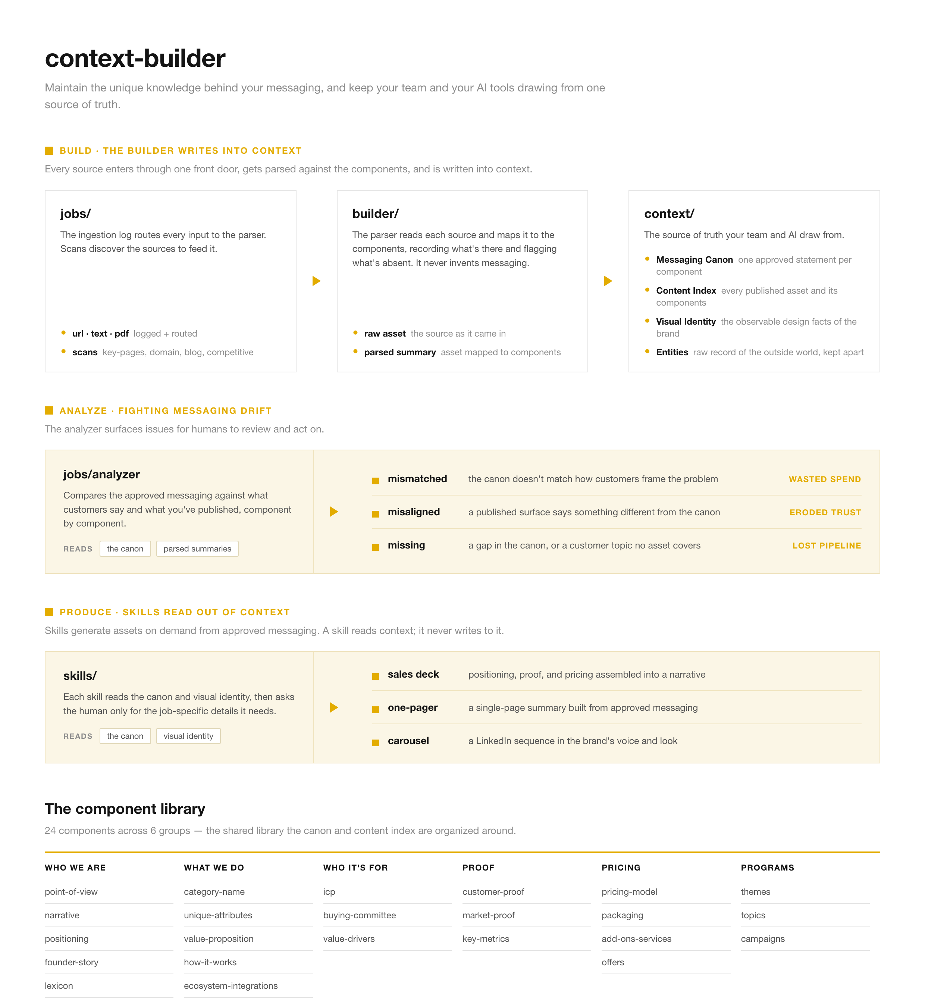

# context-builder

Context-builder is a system to help growing companies manage messaging across product marketing, content & communications, and demand gen. 

Context-builder is for **marketing leaders** who need their team to move fast with AI while keeping the quality bar high. It's like the old messaging doc, built for the AI era.

Common challenges marketing teams are facing today:
- marketing needs to move fast while also keeping the quality bar high
- messaging fragments across internal teams (marketing, CS, and sales) and channel (paid, PR, SEO, AEO)
- AI is intermediating every interaction your customers have with your brand

## Why it exists
This project is built and maintained by [Janessa Lantz](https://www.linkedin.com/in/janessalantz/) (that's me!). I built a communications team at HubSpot (post-IPO), built the dbt Labs marketing team from <$1M to close to $100M in revenue, and now work with earlier stage companies as a fractional marketing leader and consultant. Context-builder exists to support my work. I use pieces of it in every client engagement. If anything here is useful for your own work, take it!

## What it does

The context-builder keeps your messaging current and flags it the moment it drifts. The unit is the **claim**: every claim can be traced to its source, composed into units of messaging, and checked for coverage across your content and assets. Three things the system does:

1. **Keeps a human-validated claims register.** Every approved statement is a row in the [claims register](context/claims.md), typed by component, minted verbatim from your key pages, with human synthesis layered in as `source: human` rows. The rows marked `canon` are the [canon](context/messaging-canon.md) — the core the whole system protects, and what your team and your AI tools read from. A claims list that fits in a spreadsheet can be wrangled and managed.
2. **Piles up evidence as your knowledge accumulates.** Sales calls, win/loss notes, customer interviews, and everything you publish enter through one front door, get parsed for claims, and land as durable summaries plus [evidence](context/evidence.md) rows — public from what's published, private from what customers say. Customer language is captured the moment it shows up, not months later in a doc rewrite.
3. **Shows coverage and surfaces issues proactively.** The [registers](context/registers/) log your material (content, customer proof, features, offers) and the claims each item carries; the analyzer compiles the [claims map](context/claims-map.md) — which claims are evidenced, which components are empty, which assets say things the canon doesn't — and writes structured [issues](builder/issues/) for a human to act on. The LLM finds the drift; you decide what to do about it.

With the claims stable and current, your team composes them into [lockups and entry points](context/lockups.md) and builds shared [skills](skills%20-%20Work%20in%20Progress/) on top, so every asset is generated from approved messaging rather than from scratch. This is a messaging system you can run a content program on top of, or an SDR program on top of.

*(The diagram predates the v2 claims architecture and still shows the canon/index model; regenerate it from the current specs.)*

## How it works

Three groups, separated by one rule: the builder writes into context; skills read out of it.

- **[context/](context/)** is the source of truth your team and AI draw from. The [dashboard](context/dashboard.md) is the home view over it all — vitals, canon by group, registers, and open issues, compiled fresh each analyzer run and rendering the same for every deployment. Underneath: the [claims register](context/claims.md) (every approved statement, one row per claim, typed by component; the `canon-*.md` files are compiled views), the [evidence ledger](context/evidence.md) (proof piling up per claim), the [registers](context/registers/) (your content, customer proof, features, and offers, each row carrying its claims), [lockups](context/lockups.md) and [entry points](context/entry-points.md) (composed units of messaging), the [claims map](context/claims-map.md) (coverage and gaps, compiled), the [brand writing identity](context/brand-writing-identity.md) (voice, guardrails, and lexicon) and the [brand visual identity](context/brand-visual-identity.md) (the observable design facts), and [entities](context/entities/) (raw records of the outside world you track, kept at a different trust level from the canon). Everything is organized by a shared library of 26 messaging components.
- **[builder/](builder/)** is everything that keeps context current. The [parser](builder/parser.md) fetches each source, captures its claims against the components, and writes a durable summary plus the claim, evidence, and register rows. [Jobs](builder/jobs/) are the recurring work you run: the [ingestion log](builder/jobs/ingestion-log.md) is the front door where every source (a URL, a transcript, a PDF) is logged and routed; [scans](builder/jobs/scans/) discover sources to feed it; the [analyzer](builder/jobs/analyzer.md) finds drift and recompiles the map; the [codify job](builder/jobs/codify.md) turns human corrections into lasting context; findings land in [issues/](builder/issues/) for you to act on.
- **[skills - Work in Progress/](skills%20-%20Work%20in%20Progress/)** is on-demand production. Each skill reads approved slices (lockups, entry points), canon claims, and the brand identities to generate an asset (a deck, a one-pager, a carousel) when a human asks for one. Jobs write into context on a cadence; skills read out of it on demand.

## Key Concepts

- **Claim**: the atomic unit of messaging: one assertable statement, typed by a component, traceable to its source. Lives as one row in the [claims register](context/claims.md); the rows marked `canon` are your approved messaging.
- **Component**: one of the 26 building blocks of messaging (like positioning or value-drivers), each with a stable kebab-case ID. The type system claims file under.
- **Canon**: the set of `canon` claims: your approved messaging, viewed by group in the compiled `canon-*.md` files.
- **Evidence**: proof accumulating per claim, `public` (published pages, case studies, benchmarks) or `private` (sales calls, interviews), every row with provenance.
- **Register**: a log of your material and the claims each item carries: [content](context/registers/content.md), [customer proof](context/registers/customer-proof.md), [features](context/registers/features.md), and [offers](context/registers/offers.md). A component types claims; a register logs material.
- **Lockup**: a named unit of messaging composed of canon claims (a value prop with its supporting capabilities and features, a how-it-works sequence), drafted by the LLM, approved by a human, rendered by skills.
- **Entry point**: a lockup's audience-shaped sibling: the on-ramp of claims for one way a buyer arrives (a persona, a technology, an integration).
- **Claims map**: the compiled coverage view: evidence depth per claim, claim counts per component with the zeros written out, and assets carrying non-canon claims. Where gaps — missing or misaligned — show up.
- **Visual identity**: the observable design facts of the brand (colors, typography, logo treatment, style), kept in context beside the canon. The visual counterpart to the canon: skills read it so every generated asset looks like the company, not just sounds like it.
- **Brand writing identity**: how the company sounds: voice, guardrails, and lexicon, kept beside the visual identity. Skills read it so every generated asset sounds like the company, not just looks like it.
- **Surface**: where an asset lives (key_page, owned, earned, paid, or internal).
- **Raw asset**: a source the system reads, either a live URL or a stored transcript or doc. A pointer, not a copy.
- **Parsed summary**: the parser's record of one asset, mapping it to the components and claims it carries.
- **Entity**: a durable record of an outside-world actor you track (a competitor first, later events or people). Raw intelligence, kept in the builder and never treated as vetted messaging.
- **Profile**: an entity's current-state messaging, parsed against the same components as your own.
- **Feed**: an entity's append-only history of changes, one row per signal.
- **Job**: a unit of recurring work you hand the builder (an ingested source, a scan, or an analysis run). Jobs write into context.
- **Scan**: a job that discovers many URLs to ingest (key-pages, competitive-profile, competitive-feed, domain, blog).
- **Parser**: the engine that maps each raw asset against the claims register and writes the result into context.
- **Analyzer**: the job that compares your summaries against the canon claims, surfaces issues, and recompiles the claims map and canon views.
- **Issue (theme)**: a place your messaging needs attention, with a kind (mismatched, misaligned, missing, and more), the claims involved, and a confidence (high, medium, low).
- **Skill**: an on-demand generator that reads approved slices, canon claims, and the brand identities to produce an asset (a deck, a one-pager, a carousel). Skills read out of context and never write into it.
